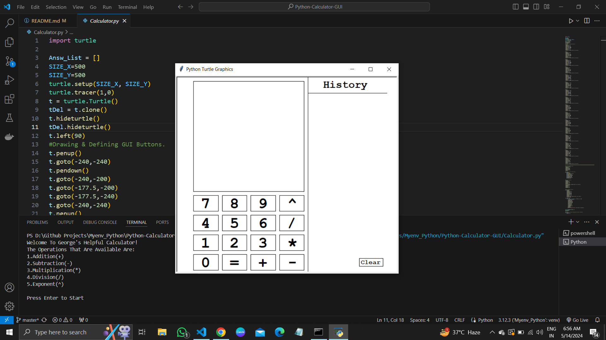

<!-- Intro  -->
<h1 align="center">
        <samp> Hi,I'm 
                <b><a target="_blank" href="https://github.com/ShubhamMca88">Shubham</a></b>
        </samp>
</h1>

        <samp> Hi, I'm a Full stack python web developer from Meerut , India. Python Programing and proficient knowledge of Django Web development , I am constantly expanding my expertise in web development. With a diverse skill set, I aim to contribute innovatively to every project.
        </samp>

 <a href="https://www.linkedin.com/in/shubham-kumar-266652237/" target="_blank">
  &nbsp;
    </a>
 <a href="https://github.com/ShubhamMca88" target="_blank">
  &nbsp;
    </a>
  

## Use To Code

## Some Code Repo...

  

<h3 align="left">Support </h3>

  

 

 

# Some Screen shot

  &nbsp;
 
 
